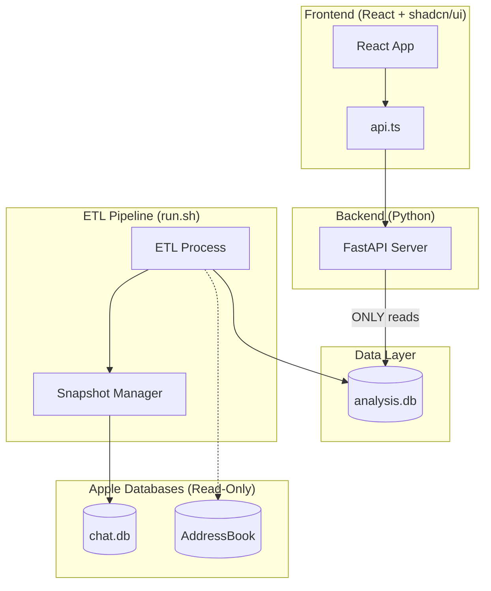
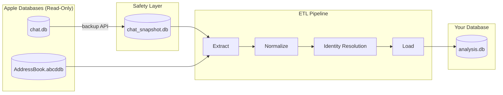
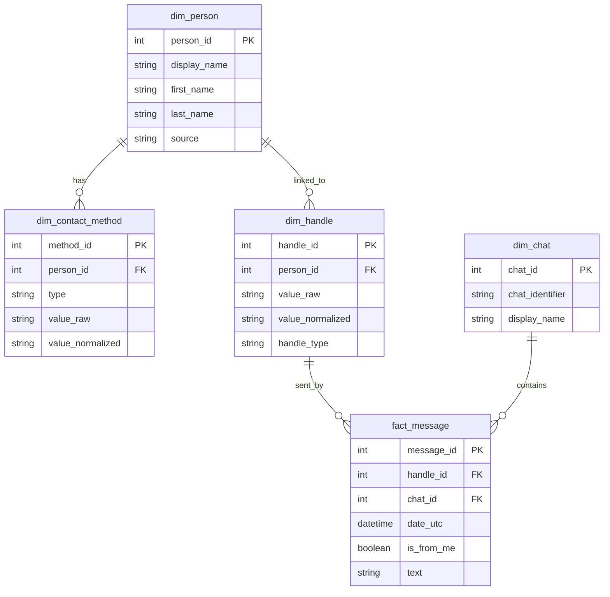
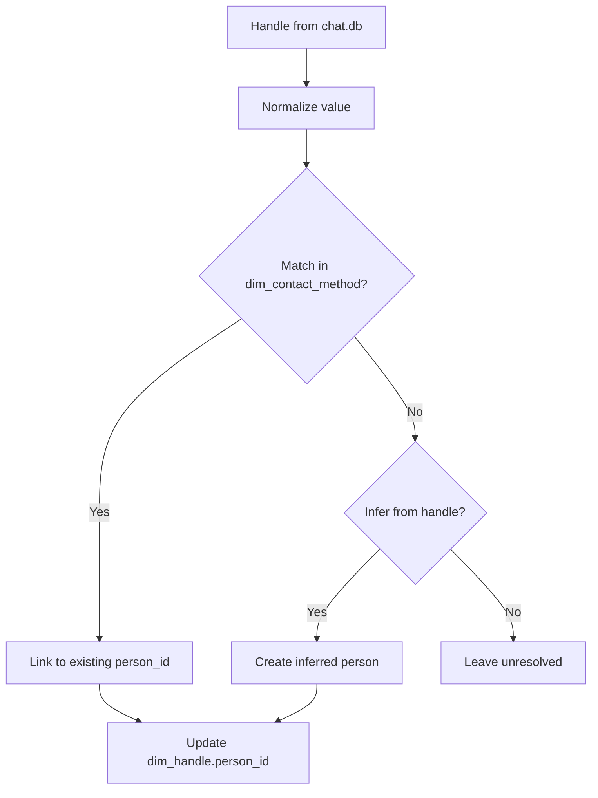
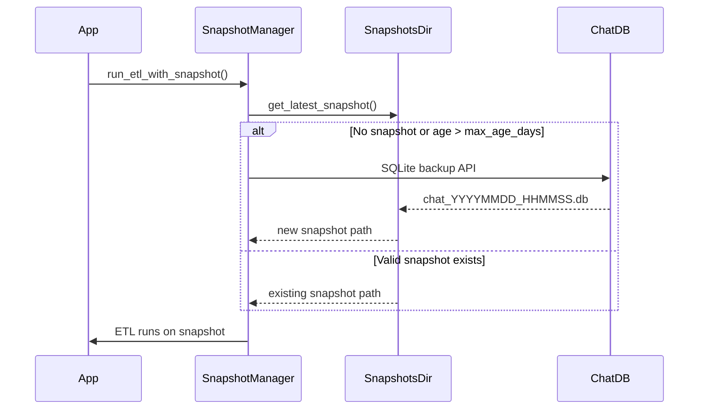

# Local Data Engineering Architecture for iMessage Analysis

This document describes a **clean, robust, local-first data architecture** for an iMessage analysis app that consumes **two Apple-managed databases**:

* `chat.db` (Messages)
* `AddressBook-vXX.abcddb` (Contacts)

and produces a **third database you own** (`analysis.db`) that acts as a stable analytical layer.

---

## System Architecture Overview



**Key architectural principle:** The API server ONLY reads from `analysis.db`. It never touches Apple databases directly. This separation provides security, simplicity, and testability.

---

## 1. The Core Problem

You want to analyze iMessage data **with human identity attached** (who is who), but:

* The data lives in *two separate databases*
* One of them (Contacts) is **not designed for analytics**
* Cross-database joins are fragile
* Apple schemas change over time

This is fundamentally a **data engineering problem**, not a SQL trick.

---

## 2. What These Databases Actually Are

### 2.1 `chat.db` (Messages)

* SQLite
* Hand-designed relational schema
* Explicit join tables
* Append-heavy event log (messages)
* Relatively stable across macOS versions

Conceptually:

> A relational event store with explicit entities (message, chat, handle)

Safe to query directly.

---

### 2.2 Contacts DB (`AddressBook-vXX.abcddb`)

* SQLite **generated by Core Data**
* Tables prefixed with `Z*`
* Schema represents an **object graph**, not a domain model
* Primary keys are opaque and unstable
* Schema changes frequently between macOS versions

Conceptually:

> A serialized object graph, not a database API

You *can* query it — but you should **never build analytics directly on top of it**.

---

## 3. Why Direct Joins Are the Wrong Abstraction

You might be tempted to:

* Query both DBs directly
* Use `ATTACH DATABASE`
* Create cross-database views

This fails long-term because:

* Contacts schema is unstable
* Core Data relationships are opaque
* Performance degrades
* You cannot safely add indexes or overrides

Instead, you need a **translation boundary**.

---

## 4. Option B: The Right Architecture

### High-level idea

Treat Apple databases as **read-only sources**, and ETL the *minimal useful subset* into a **derived database you own**.

```
Apple DBs (read-only)
 ├── chat.db
 └── AddressBook-vXX.abcddb
        │
        ▼
  ETL / Normalization
        │
        ▼
   analysis.db  ← your schema, your rules
```

This is a **local data warehouse**, even if it's just SQLite.

### ETL Pipeline Flow



---

## 5. Responsibilities by Layer

### Source layer (Apple DBs)

* Queried read-only
* Never mutated
* Treated as unstable external APIs

### Translation layer (ETL)

* Normalizes timestamps
* Normalizes phone numbers / emails
* Resolves identity
* Shields app from schema changes

### Analytics layer (`analysis.db`)

* Stable schema
* Indexed
* Query-friendly
* App-facing

---

## 6. Minimal Schema You Own (`analysis.db`)

### 6.1 People

```sql
dim_person
----------
person_id        -- your UUID
first_name
last_name
display_name
source           -- 'contacts', 'manual', etc
```

This is the **canonical human**.

---

### 6.2 Contact Methods

```sql
dim_contact_method
------------------
method_id
person_id
type             -- 'phone' | 'email'
value_raw
value_normalized -- E.164 phone, lowercase email
```

Extracted from Contacts DB. Stable and simple.

---

### 6.3 Handles (from Messages)

```sql
dim_handle
----------
handle_id
value_raw
value_normalized
```

Bridges Messages → People.

---

### 6.4 Messages

```sql
fact_message
------------
message_id
chat_id
date_utc
is_from_me
handle_id
person_id        -- resolved later
text
```

Your primary fact table.

### Entity Relationship Diagram



---

## 7. Identity Resolution (Critical Piece)

Identity resolution is **not a join** — it's a process.

### Inputs

* `dim_handle.value_normalized`
* `dim_contact_method.value_normalized`

### Output

* `fact_message.person_id`

### Rules (example)

1. Exact phone match (normalized)
2. Exact email match
3. Cache result in `analysis.db`
4. Allow manual overrides later

This avoids re-running fuzzy logic on every query.

### Identity Resolution Flow



---

## 8. Snapshot-First Strategy (Safety Pattern)

**The ETL pipeline NEVER accesses the original chat.db directly.**

Instead, it works from snapshots stored in a dedicated directory. This provides:

### Why Snapshots?

* **Safety**: Original database is never touched, even accidentally
* **Consistency**: Analysis runs on a point-in-time copy (no mid-ETL changes)
* **No lock contention**: Won't compete with iMessage for database access
* **Reproducibility**: Same snapshot = same analysis results

### How It Works

```
Original chat.db          Snapshot Directory              analysis.db
~/Library/Messages/       ~/.imessage_analysis/snapshots/
                    
┌─────────────┐           ┌──────────────────────┐       ┌─────────────┐
│  chat.db    │──backup──►│chat_20250115_103045.db│──ETL──►│ analysis.db │
│ (READ ONLY) │           │chat_20250108_091230.db│       │ (YOUR DATA) │
└─────────────┘           │      ...              │       └─────────────┘
                          └──────────────────────┘
```

### Snapshot Lifecycle



1. Before ETL runs, check if a recent snapshot exists
2. If no snapshot or snapshot exceeds `max_age_days` (default: 7), create new one
3. Use SQLite's backup API for safe, consistent snapshots
4. ETL reads exclusively from the snapshot

### Configuration

```python
Config(
    snapshots_dir="~/.imessage_analysis/snapshots",  # Where snapshots live
    snapshot_max_age_days=7,                          # Refresh threshold
)
```

### Cleanup

Old snapshots can be cleaned up automatically (keep_count=3 by default).

---

## 9. API Architecture (Security Boundary)

**The API server NEVER accesses Apple databases directly.**

This is a deliberate architectural decision that provides defense in depth.

### Security Boundary Diagram

```
┌─────────────────────────────────────────────────────────────────┐
│                     SECURITY BOUNDARY                            │
├─────────────────────────────────────────────────────────────────┤
│                                                                  │
│   Apple DBs ──► ETL ──► analysis.db ──► API ──► Frontend        │
│   (offline)            (your data)     (read-only)               │
│                                                                  │
└─────────────────────────────────────────────────────────────────┘
```

### Why This Matters

1. **Defense in depth**: Even if the API has a bug, it can't corrupt Apple's data
2. **Clear separation**: ETL is the only code that touches source databases
3. **Simpler API**: No snapshot logic, no permission checks, just reads
4. **Testable**: API can be tested with a synthetic analysis.db
5. **Faster startup**: No ETL checks on every API request

### Implementation

- API returns HTTP 503 if `analysis.db` doesn't exist
- All endpoints query `analysis.db` exclusively
- `/diagnostics` endpoint reports database health and enrichment stats
- `run.sh` handles ETL automatically before starting the API

### What the API Provides

| Endpoint | Purpose |
|----------|---------|
| `/summary` | Database counts (messages, chats, handles, persons) |
| `/latest` | Recent messages with sender info |
| `/top_chats` | Most active conversations |
| `/contacts` | All contacts sorted by recency |
| `/contacts/{id}` | Detailed contact view with stats |
| `/diagnostics` | Database health and enrichment metrics |

---

## 10. Refresh / Incremental Update Strategy

You should **never rebuild everything**.

### Messages

* Track max imported `message.date`
* Import only newer rows

### Contacts

* Check Contacts DB file mtime
* Re-extract only if changed

### Identity resolution

* Only resolve new or changed handles

This keeps startup fast even with large histories.

---

## 11. Why This Is the Right Tradeoff

This architecture gives you:

* Stability against Apple schema churn
* Fast, indexed queries
* Clear separation of concerns
* Room to grow (DuckDB, Postgres later)

You're doing **just enough data engineering** to stay sane.

---

## 12. Mental Model to Keep

* Apple DBs = undocumented external APIs
* Contacts DB = object graph, not analytics store
* `analysis.db` = your contract
* Option B = translation boundary
* **Snapshots = safety boundary** (never touch the original)

---

## 13. Next Questions (Intentionally Deferred)

* What *additional* signals from Contacts are worth extracting?
* Can identity + conversations be modeled as graphs?
* Are there network / graph-theoretic insights worth computing?

Those are architectural *layer 2* questions — and worth asking only after this foundation is in place.
